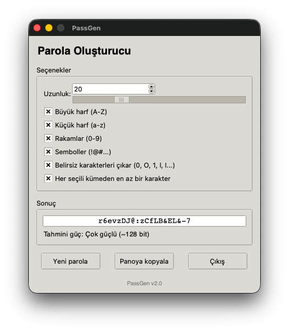

# PassGen v2

Güvenli rastgele parola oluşturucu - Tkinter tabanlı modern arayüz


## 🎨 Arayüz



## ✨ Özellikler

- 🔒 **Güvenli**: Python'un `secrets` modülünü kullanarak kriptografik olarak güvenli parolalar oluşturur
- 🎨 **Modern Arayüz**: Temiz ve kullanıcı dostu Tkinter arayüzü
- 🎛️ **Esnek Ayarlar**: Genişletilebilir parola seçenekleri
- 📊 **Güç Analizi**: Parola gücünün bit cinsinden tahmini
- 📋 **Panoya Kopyalama**: Tek tıkla parolayı kopyalama
- 🎯 **Akıllı Karakter Dağılımı**: Seçili kümelerden en az bir karakter garantisi
- 🚫 **Belirsiz Karakterler**: İsteğe bağlı olarak 0O1lI gibi karışıklık yaratan karakterleri hariç tutma

## 🚀 Kurulum

### Çalıştırma

```bash
# Repoyu klonla
git clone https://github.com/kullanici-adiniz/passgen-v2.git
cd passgen-v2

# Doğrudan çalıştır
python3 passgen.py

# Venv ile çalıştır (önerilen)
python3 -m venv .venv
source .venv/bin/activate  # Windows: .venv\Scripts\activate
python3 passgen.py
```

### Derleme (PyInstaller)

```bash
# PyInstaller ile derleme
pyinstaller --noconsole --windowed --icon=assets/icon.icns --name=PassGen passgen.py
```

## 📖 Kullanım

1. **Uzunluk**: Kaydırma çubuğu veya spinbox ile parola uzunluğunu ayarlayın (4-64 karakter)
2. **Karakter Tipleri**: İstediğiniz karakter setlerini seçin:
   - Büyük harfler (A-Z)
   - Küçük harfler (a-z) 
   - Rakamlar (0-9)
   - Semboller (!@#$%^&*...)
3. **Seçenekler**:
   - Belirsiz karakterleri çıkar (0, O, 1, l, I)
   - Her seçili kümeden en az bir karakter
4. **Oluştur**: "Yeni parola" butonuna basın veya ayarları değiştirin
5. **Kopyala**: "Panoya kopyala" ile parolayı kopyalayın


### Parola Gücü Seviyeleri

| Güç | Bit Aralığı | Açıklama |
|-----|-------------|----------|
| Zayıf | < 36 bit | Kısa parolalar |
| Orta | 36-59 bit | Günlük kullanım için |
| Güçlü | 60-99 bit | Hassas hesaplar için |
| Çok güçlü | ≥ 100 bit | Yüksek güvenlik gerektiren durumlar |
